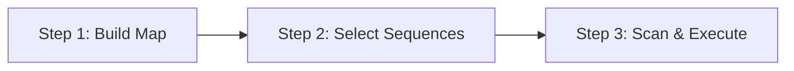

# Replace

The **Replace** module lets you batch-replace media files across one or more sequences in your Premiere Pro project. Build a mapping of old media to new media, select which sequences to process, scan for all instances, and execute using one of three modes.

## Workflow

The Replace module is a **three-step wizard**:

1. **[Build Replacement Map](replacement-map.md)** — Define old → new media mappings.
2. **[Select Sequences](sequence-selection.md)** — Choose which sequences to process (all or specific).
3. **[Scan & Execute](execution-modes.md)** — Scan for matching clips and execute using one of three modes.

## Execution Modes

| Mode | What It Does | Destructive? |
|------|-------------|--------------|
| **Offline/Online** | Relinks the project item to point at the new file | No |
| **Neighbor** | Places replacement clips on new adjacent tracks | No |
| **Replace** | Deletes originals and inserts replacements in place | Yes |

See [Execution Modes](execution-modes.md) for full details on each mode.

## Key Features

- **Batch processing** — Replace media across all sequences or a selected subset.
- **Clip preservation** — In Replace mode, effects, keyframes, markers, transitions, and label colors are preserved and reapplied to the new clips.
- **Linked A/V handling** — Video and audio components of linked clips are handled separately for maximum reliability.
- **Validation** — Scans verify clip identity using canonical keys, stable IDs, and normalized file paths.
- **Reporting** — Detailed results with per-instance status, exportable to a text report.

## Sections

- [Replacement Map](replacement-map.md) — Step 1: building old-to-new mappings
- [Sequence Selection](sequence-selection.md) — Step 2: choosing scope
- [Execution Modes](execution-modes.md) — Step 3: the three replacement strategies
- [Results & Reports](reports.md) — understanding and exporting results
